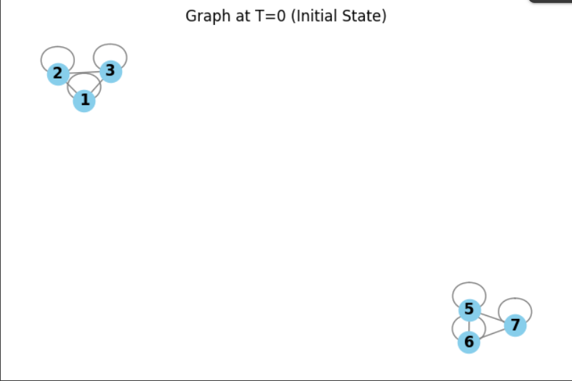
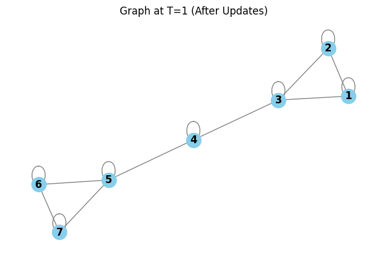
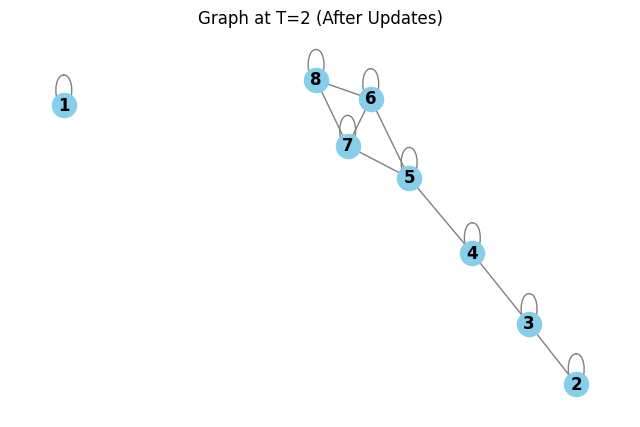

# DOMLPA: Dynamic Overlapping Community Detection

This project is a Python implementation of the **Dynamic Overlapping Multi-Label Propagation Algorithm (DOMLPA)**.  
It is based on the pseudocode from the 2015 paper:

**Title:** Overlapping Community Detection in Temporal Networks  
**Authors:** Anupama Angadi and P. Suresh Varma  
**Publication:** Indian Journal of Science and Technology, Vol 8(31)  
**DOI:** [10.17485/ijst/2015/v8i31/70569](https://indjst.org/articles/overlapping-community-detection-in-temporal-networks)

---

## About the Algorithm

The DOMLPA algorithm is designed to find communities in social networks with two key features:

- **Dynamic:** Efficiently handles evolving networks (where nodes/edges are added or removed) by updating only affected parts instead of recalculating everything.  
- **Overlapping:** Allows a single node to belong to multiple communities simultaneously — reflecting realistic social structures (e.g., someone can be in both a “family” and a “work” group).

---

## Implementation Details

This implementation is designed to run in a **Google Colab** notebook and uses the following Python libraries:

- `networkx` – for graph creation and management  
- `matplotlib` – for visualization at each timestamp  

The code structure corresponds to the three main algorithms described in the paper:

1. **Algorithm 3 (MLPA):** Static community detection for a single graph snapshot.  
2. **Algorithm 2 (Update Network):** Processes edge updates (additions/deletions) and re-runs propagation.  
3. **Algorithm 1 (DOMLPA):** Main driver script managing temporal evolution, calling the above two as needed.

---

## Results

Below are the visual outputs of the algorithm at different timestamps.

### Graph at T = 0 (Initial State)

### Graph at T = 1 (After Updates)

### Graph at T = 2 (After Updates)

---

## How to Run

1. Open the notebook in Google Colab.  
2. Upload your input graph (as edge list or adjacency data).  
3. Execute cells sequentially to visualize temporal evolution.

---

## References

Angadi, A., & Varma, P. S. (2015).  
*Overlapping Community Detection in Temporal Networks.*  
**Indian Journal of Science and Technology**, 8(31).  
DOI: [10.17485/ijst/2015/v8i31/70569](https://indjst.org/articles/overlapping-community-detection-in-temporal-networks)
